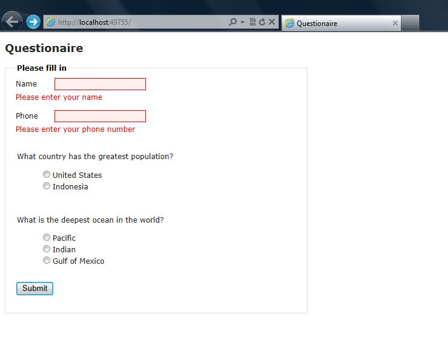

Yummy.Questionaire
==================

Simple Questionaire MVC Website

When applying for a job a couple of years ago, the company asked me to demonstrate my ability by
creating a simple website based on a questionaire.

This is the project I produced for them.

###Installation
1. Create a database in sql server
2. run the [MVCQuestionaire/Install/install.sql](MVCQuestionaire/Install/install.sql)
3. Edit the Connection String in the Web.config to use the new database.</li>
4. Build and run the solution.

###Database Design

###User Interface

